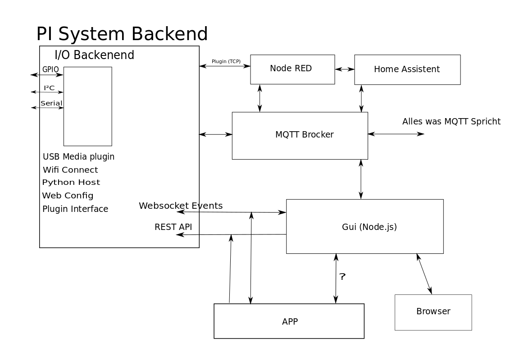

# Das Konzept / die Hinter diesem Projekt

## Die Probleme

Es gibt eine vielfallt an Sensoren und Aktoren im Fahrzeug bzw im Haus. Von günstig bis Teuer aber auch ganze Systeme wie zum Beispiel Victron Venus.
...
Aber auch eine Menge Menschen die das nutzen wollen / würden aber Entweder sind sie Teuer oder sind Komplex leider trifft das auf viel Opensource Projekte
zu. Installieren ist oft schwierig oder es für dann wieder zu einem geschlossen System. Zum Bespiel HA OS.
...
Nutzen der Lokalen GPIO.
Das automatische Herrunter fahren wenn Zündung aus oder Batterie Spannung zu niedrig.
Dynamisch Unterstüzen von Wechseln WLAN Verbindungen
Datensicherung für Händy Fotos
Wohnmobil Sensoren / Aktoren 
Locals Display sprich am PI Angeschlosses Display

## Das Konzept der Software

### Der Main Service

ist ein Informationen Sammler und Verteiler. Ziel ist es daten aus vielen Quellen auf den kleinsten möglichen Nennen zusammen zu fassen und so die Verarbeitung
Wiederum massiv zu vereinfachen. Der kleinst gemeisame Nenner ist in meinen Augen ein Key Value Pair also ein Schlüssel Name paar. Also Tür Offen oder draus
5 Grad. Wir fahren in die Richtung 270°.
Der Service soll aber auch die Entwicklung / Anpassungen auf ein Minimum an Technisches wissen reduzieren um viele Abzuholen.
Bzw den ein oder Anderen Geräte Treiber einfach per Konfiguration ein und ausschalten können.
Um das zu Erreichen ist die die Einbettung von Pyhton3 gedacht aber auch ein C++ Addon Schnittstelle. Auch ein Template mit dem man in PlattformI0
eigene Mircocontroller Programmieren kann und so in das gesamt System Integierien.
Desweiteren ist der Service ein Html Seiten Host für die Konfiguration per Webbrowser und eine sehr einfache GUI.
Auch ein Websocket Server steht zu verfügung über den man bei Events im System Informiert wird.
Im weiteren stellt der Service system Funktionen bereit wie zum Beispiel Abfragen der derzeit verfügbaren WLAN's oder das Abspielen von Musik Dateinen.
Für die Integration in gößere Systeme ist eine Schnittstelle zu NodRed vorgesehen und dort die daten hin zu senden Key Value und zu bekommen.
NodRed weil man das auch als Addon in HA Installieren kann.

Integration als Systemd Dienst

Als Logging schreiber

Vielleicht:

GUI mit SDL2 siehe [Carnine](www.carnine.de) wo bei halt die Frage ist man kann ja auch ein Browser als GUI nehmen wo bei da halt echt resourcen braucht.
Chrome läuft nicht auf einem PI2 die GUI schon und flüssig mit anzeige einer Karte. Ok die Karte runkel schon ein bisschen wenn man schneller fährt.

Karte aus den Openstreet Map daten.

### Die GUI

Vielleicht wird es auch eine GUI mit React und Typescript geben wäre etwas was ich noch Lernen möchte. Habe mich für Flutter entschieden.
Weil ich das jetzt auch für den Job brauche

## Ziele

* Anforderung an die Hardware so klein wie möglich so groß wie nötig aber ein linux als Betriebsystem
* Muss ohne Internet Funktionieren
* einfach Installieren aber auch Integriebar sein
* Vollständig Dokumentiert (ja ich weiß das Unmöglich)

